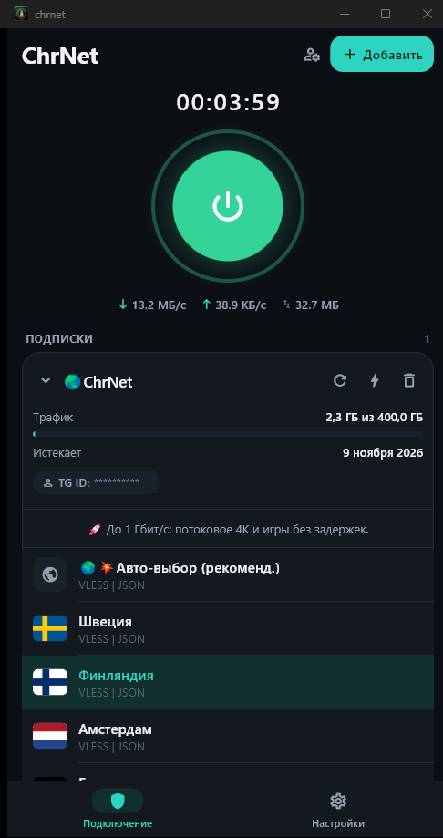

  

  <h1>ChrNet VPN</h1>
  
Быстрый и безопасный VPN-клиент на Flutter (Android + Windows)

  
Текущая версия: <strong>2.0.2+10</strong>

  
  
  

## Возможности
- Поддержка VLESS через Xray-core — все транспорты (TCP, WebSocket, gRPC, xhttp, mKCP, HTTPUpgrade) поверх TLS и Reality
- Импорт готовых JSON-конфигов Xray с собственным роутингом
- Импорт из буфера обмена, deep link и QR-кода
- Обновление подписок с информацией о трафике и сроке действия
- Список серверов с флагами стран и проверкой ping
- Роутинг: локальная сеть и российские сайты идут напрямую, мимо туннеля
- Светлая/тёмная/системная тема и режим «Меньше анимаций» для экономии батареи
- Режимы Windows: `system_proxy` / `tunnel`

## Загрузки

<table>
  <thead align="left">
    <tr>
      <th>ОС</th>
      <th>Скачать</th>
    </tr>
  </thead>
  <tbody align="left">
    <tr>
      <td>Windows x64</td>
      <td>
        
      </td>
    </tr>
    <tr>
      <td>Android</td>
      <td>
        
        
      </td>
    </tr>
    <tr>
      <td>macOS</td>
      <td>
        
      </td>
    </tr>
    <tr>
      <td>iOS</td>
      <td>
        
      </td>
    </tr>
  </tbody>
</table>

## Сообщество

<table>
  <thead align="left">
    <tr>
      <th>Платформа</th>
      <th>Ссылка</th>
    </tr>
  </thead>
  <tbody align="left">
    <tr>
      <td>Поддержка в Telegram</td>
      <td>
        
      </td>
    </tr>
  </tbody>
</table>

